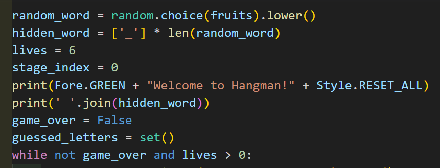
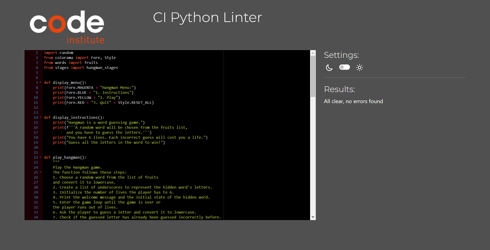
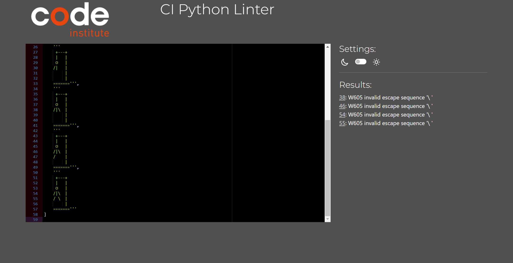
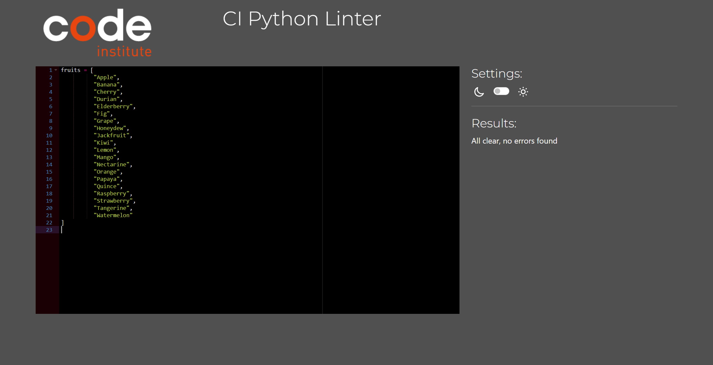

# The Hangman Game


*The link to [the Hangman Game](https://hangmanap-507a8f5d3e20.herokuapp.com/)*

The Hangman game is a classic word guessing game where a player tries to guess a hidden word by suggesting letters one at a time. The game's name comes from the graphical representation of incorrect guesses, which gradually builds up a stick figure of a "hanged" man.

---

## How to play:

  1. Click this *[link](https://hangmanap-507a8f5d3e20.herokuapp.com/)* or copy this text: `https://hangmanap-507a8f5d3e20.herokuapp.com/` and paste it in your browser's address bar.
  1. As soon as the page is loaded, click 'RUN PROGRAM'.
  1. Press number 1 and then hit Enter to load the instructions.
  1. Press number 2 and then hit Enter to start the game.
  1. The game selects a random word from a predefined list of words.
  1. The chosen word is represented by a series of underscores, with each underscore indicating a letter in the word.
  1. The player has a limited number of attempts (lives) to guess the letters in the word.
  1. On each turn, the player guesses a letter. If the letter is present in the word, all occurrences of that letter are revealed in the hidden word.
  1. If the guessed letter is not in the word, the player loses a life, and a part of the Hangman is drawn on the screen.
  1. The game continues until the player guesses the entire word or runs out of lives.
  1. If the player successfully guesses the word before running out of lives, they win the game.
  1. If the player runs out of lives before guessing the word, the game ends, and the correct word is revealed.


---

## User Stories
### First Time Visitor Goals:
* As a first-time visitor, I want to understand the rules and gameplay of the Hangman game, so I can quickly get started without confusion.
* As a new player, I want clear instructions on how to guess letters and the consequences of incorrect guesses, so I can strategize and maximize my chances of winning.
* As a player unfamiliar with the game's words, I hope the game provides a varied and interesting selection of words to guess, making the gameplay engaging and enjoyable.
* As a user trying out the game for the first time, I expect an intuitive and easy-to-navigate menu that allows me to choose between viewing instructions, playing the game, or quitting.
* As a new player, I hope the game warns me if I repeat an incorrect letter guess, so I can avoid losing lives unnecessarily and improve my chances of winning.
* As a player experiencing the Hangman game for the first time, I look forward to celebrating my victories and receiving clear messages when I win or lose the game.
* As a user playing the game for the first time, I expect the game to maintain a fair level of challenge, ensuring that it's not too easy or too difficult to guess the hidden words.

### Frequent Visitor Goals:
* As a returning player, I expect the game to provide regular updates with new word lists, bug fixes, and feature enhancements, keeping the game fresh and engaging over time.
* As a frequent visitor, I look forward to unlocking achievements or earning rewards based on my performance, providing additional motivation to keep playing and improving. 

---

## Features

 **When the program is loaded**

The user can see the hangman menu and he can choose from:


**When the user choose instructions.**
- The instructions will shows up;


**When the user choose play.**
- The game will start;


**When the user chose "Quit"**
The user will see a goodbye message, and the program will be stopped.


---

## Flowchart

The flowchart represents the logic of the application:

  

---

## Technologies Used

### Languages:

- [Python 3.11.4](https://www.python.org/downloads/release/python-3114/): used to anchor the project and direct all application behavior

- [JavaScript](https://www.javascript.com/): used to provide the start script needed to run the Code Institute mock terminal in the browser

- [HTML](https://developer.mozilla.org/en-US/docs/Web/HTML) used to construct the elements involved in building the mock terminal in the browser

### Frameworks/Libraries, Programmes and Tools:
#### Python modules/packages:

##### Standard library imports:

- [random](https://docs.python.org/3/library/random.html) was used to implement pseudo-random number generation.

##### Third-party imports:

- [Colorama](https://pypi.org/project/colorama/) was used to add colors and styles to the project.

#### Other tools:

- [VSCode](https://code.visualstudio.com/) was used as the main tool to write and edit code.
- [GitHub](https://github.com/) was used to host the code of the website.
- [heroku.com](https://www.heroku.com/) was used to deploy the project.


---

## Bugs

+ **Solved bugs**
1. In the beginning, the problem was that when the user entered the first letter, it was not stored or dealt with, and the hidden word appeared again

- *Solutions:* hidden_word = ['_'] * len(random_word)  was duplicated twice so I deleted the duplicate.


+ **Unsolved bugs**
- None were found.

---

## Testing

The program was tested constantly during its development process.
Other users also tested it in order to spot possible grammatical mistakes that the code may present.

### Validators

[CI Python Linter](https://pep8ci.herokuapp.com/) This checking was done manually by copying python code and pasting it into the validator.

- **run.py**
No errors were found:



- **stages.py**
Some errors were found:



- **words.py**
No errors were found:



---

## Deployment


This is a Hangman web application that can be deployed both locally and remotely on Heroku. The game allows users to play Hangman by guessing a word letter by letter.

## Prerequisites

Before deploying the Hangman project, ensure that you have the following installed on your local PC:

- [Python](https://www.python.org/downloads/) (version 3.x)
- [pip](https://pip.pypa.io/en/stable/installing/) (Python package manager)

## Local Deployment

To deploy the project locally, follow these steps:

1. Clone the repository using either of the methods below:
   - Download ZIP File:
     - Go to the [GitHub Repo page](https://github.com/WaseemRabah/Hangman).
     - Click the "Code" button and download the ZIP file containing the project.
     - Extract the ZIP file to a location on your PC.

   - Clone the Repository:
     - Open a terminal or command prompt.
     - Run the following command:
       ```
       git clone https://github.com/WaseemRabah/Hangman.git
       ```
2. Navigate to the project directory: cd Hangman


3. Install the required modules by running the following command:
   pip3 install -r requirements.txt


4. Run the Hangman application locally:
   python3 app.py

The Hangman game will be accessible at `http://127.0.0.1:5000/` in your web browser.


## Remote Deployment on Heroku

To deploy the project as a remote web application on Heroku, follow these steps:

1. Clone the repository (if you haven't already) by running the following command:
   git clone https://github.com/WaseemRabah/Hangman.git


2. Create your own GitHub repository to host the Hangman project.

3. Set the remote repository location to your newly created GitHub repository:
   git remote set-url origin <Your GitHub Repo Path>

Replace `<Your GitHub Repo Path>` with the URL of your GitHub repository (e.g., `https://github.com/your-username/your-repo-name.git`).

4. Push the files to your GitHub repository:
   git push


5. Create a Heroku account if you don't have one: [Heroku](https://dashboard.heroku.com).

6. Install the [Heroku CLI](https://devcenter.heroku.com/articles/heroku-cli) on your local machine.

7. Log in to Heroku through the CLI:
   heroku login

Enter your Heroku account credentials when prompted.

8. Create a new Heroku application:
   heroku create <your-app-name>
  Replace `<your-app-name>` with a unique name for your Heroku application.

9. Deploy the application to Heroku:
   git push heroku master

This will push the code from your GitHub repository to Heroku and start the deployment process.

10. After a successful deployment, Heroku will provide you with a link to access your Hangman web application. It will look something like: `https://your-app-name.herokuapp.com/`.

---
## Credits

- Color formatting: [Colorama](https://pypi.org/project/colorama/).
- [heroku.com](https://heroku.com/) for hosting the application.


---
## Acknowledgements

[Juliia Konovalova](https://github.com/IuliiaKonovalova)

I would like to thank my mentor Juliia Kononalova for her great support during my illness !